# MFA & Conditional Access Implementation

> **Lab Environment:** Microsoft 365 Business Premium (Entra ID P1) — *Fazi IT Lab tenant*  
> **Focus:** Enforcing MFA through Conditional Access policies with scoped user assignments, cloud app targeting, and named locations.

---

## 1. Overview

This lab documents the hands-on configuration of **Microsoft Entra multifactor authentication (MFA)** and **Conditional Access (CA)** policies to secure user sign-ins. The implementation follows Zero Trust principles by enforcing MFA based on user scope, cloud application targets, and geographic conditions rather than static per-user enforcement.

---

## 2. Tenant Setup & User Creation

### 2.1 Microsoft 365 Developer Program

Started by joining the Microsoft 365 Developer Program to obtain a free sandbox tenant for lab purposes.

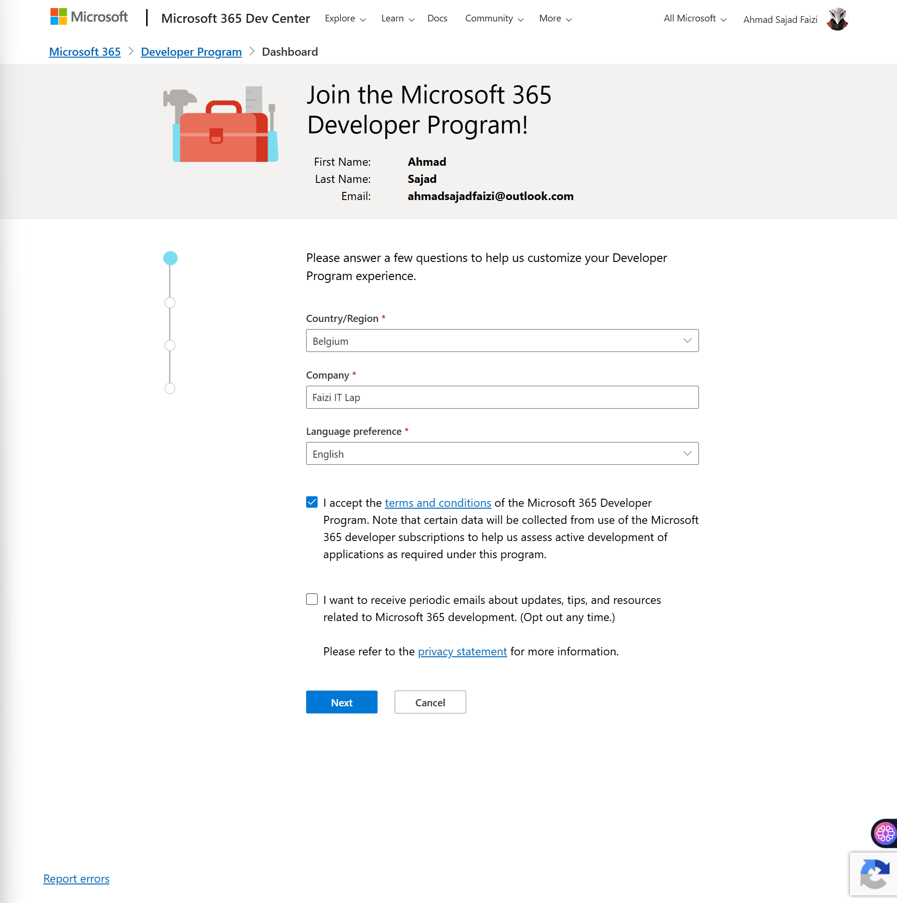

### 2.2 Tenant Configuration

Configured the tenant with custom domain and admin credentials:

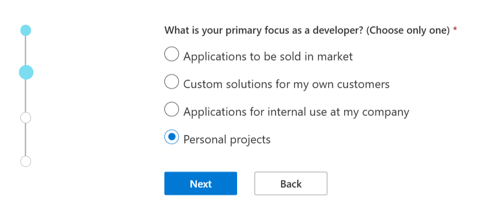

### 2.3 User Provisioning

Created test users in the Microsoft Entra admin center for policy testing:

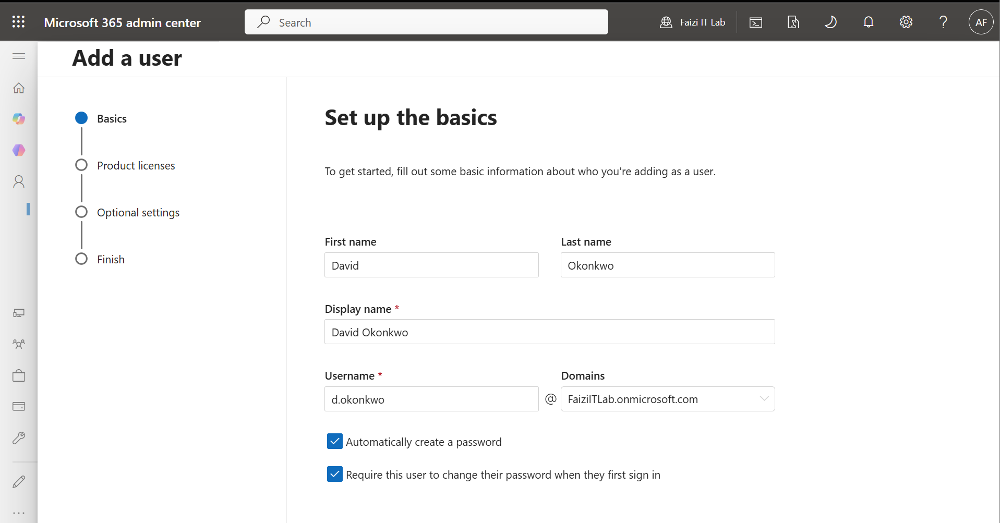

Assigned Microsoft 365 Business Premium licenses to enable MFA and Conditional Access features:

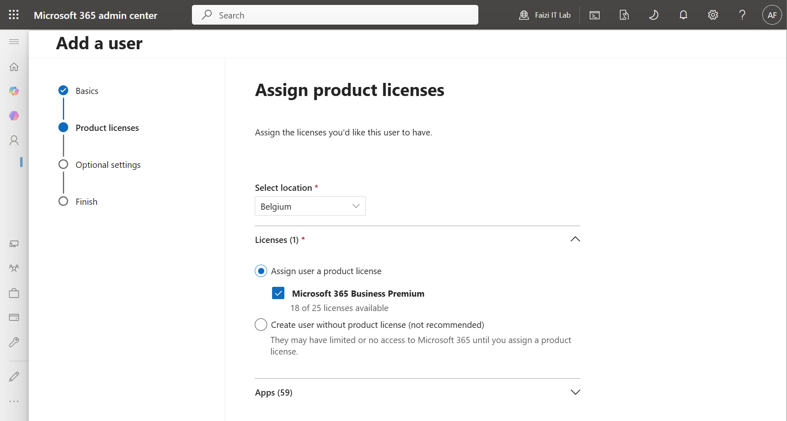

---

## 3. MFA Configuration

### 3.1 Authentication Methods Policy

Configured the **Authentication methods policy** in the Microsoft Entra admin center to define which MFA methods are available to users:

| Setting | Configuration |
|---------|-------------|
| **Microsoft Authenticator** | Enabled (push notifications + TOTP codes) |
| **Text Message** | Enabled for verification codes |
| **Voice Call** | Enabled as backup method |
| **Software OATH tokens** | Enabled for compatible authenticator apps |

> **Navigation:** *Microsoft Entra admin center* → *Protection* → *Authentication methods* → *Policies*

### 3.2 MFA Enforcement Settings

Reviewed the MFA enforcement configuration and security defaults impact:

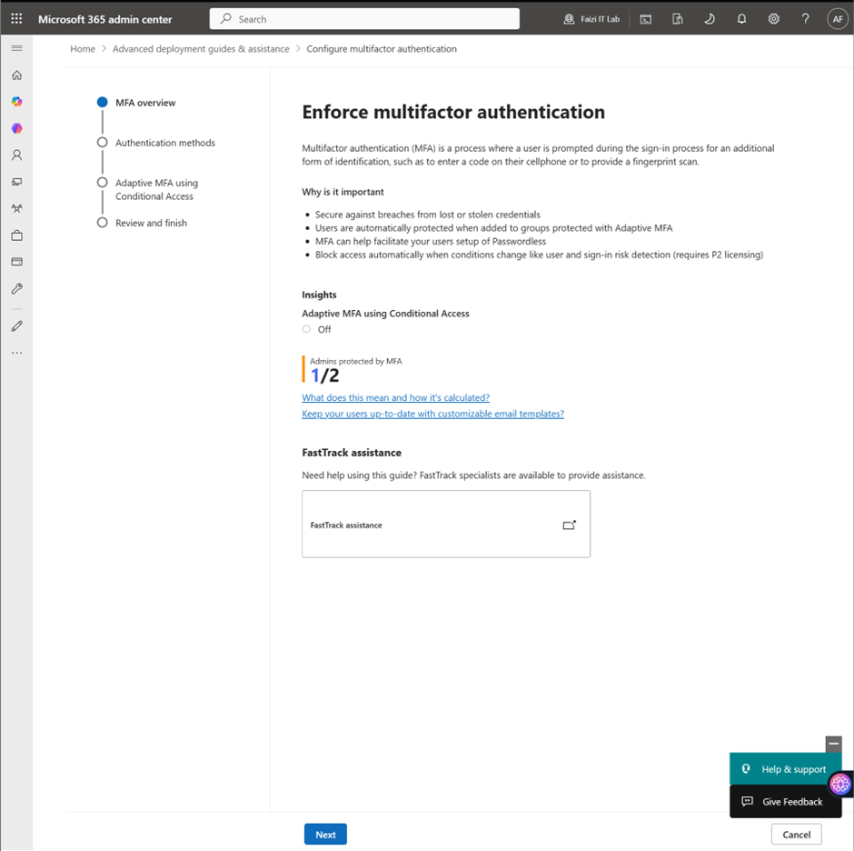

> **Note:** Security defaults were initially enabled. Creating custom Conditional Access policies required disabling security defaults first.

### 3.3 User Registration Experience

Users are prompted to register MFA methods at first sign-in via the **security info registration** wizard. The enforced method priority:

1. **Microsoft Authenticator (recommended)** — push notification or time-based code
2. **Phone (SMS/Voice)** — fallback for users without smartphones
3. **Alternative methods** — configured per organizational need

---

## 4. Conditional Access Policies

Four distinct Conditional Access policies were created to enforce MFA with varying scope and target conditions.

### 4.1 Policy 1: Require MFA for All Users (All Cloud Apps)

**Purpose:** Baseline MFA enforcement for all users accessing Microsoft cloud services.

| Component | Configuration |
|-----------|---------------|
| **Users** | All users (scoped assignment) |
| **Target resources** | All cloud apps |
| **Conditions** | None (applies to all sign-ins) |
| **Access controls** | Require multifactor authentication |
| **Session** | None |
| **State** | **On** |

**Rationale:** This is the foundational policy that ensures no user can access Microsoft 365 services without completing MFA.

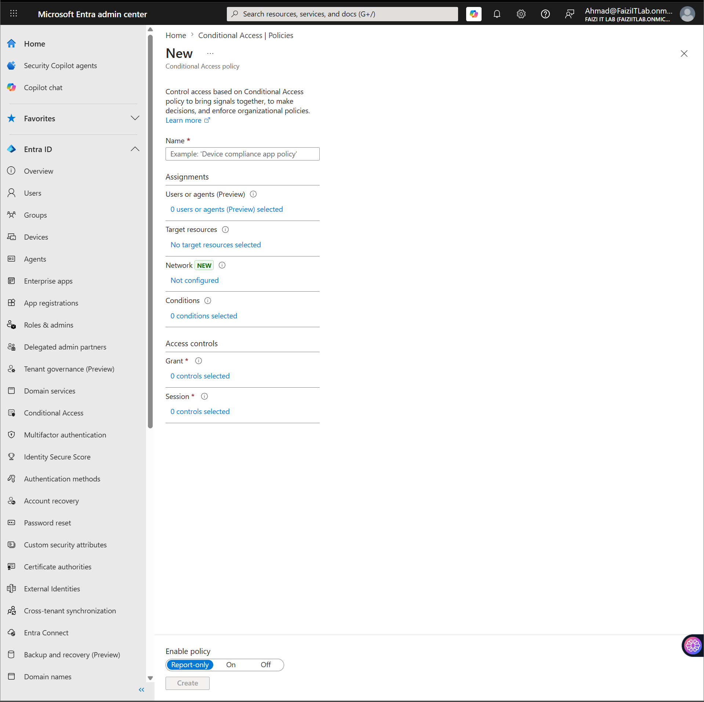

### 4.2 Policy 2: Block Non-EU Countries

**Purpose:** Geographic restriction to block sign-ins from outside the European Union.

| Component | Configuration |
|-----------|---------------|
| **Users** | All users |
| **Target resources** | All resources (All cloud apps) |
| **Conditions** | Locations: Block Non-EU Countries |
| **Access controls** | Block access |
| **State** | **On** |

**Rationale:** Prevents access from high-risk geographic regions outside the organization's operational area.

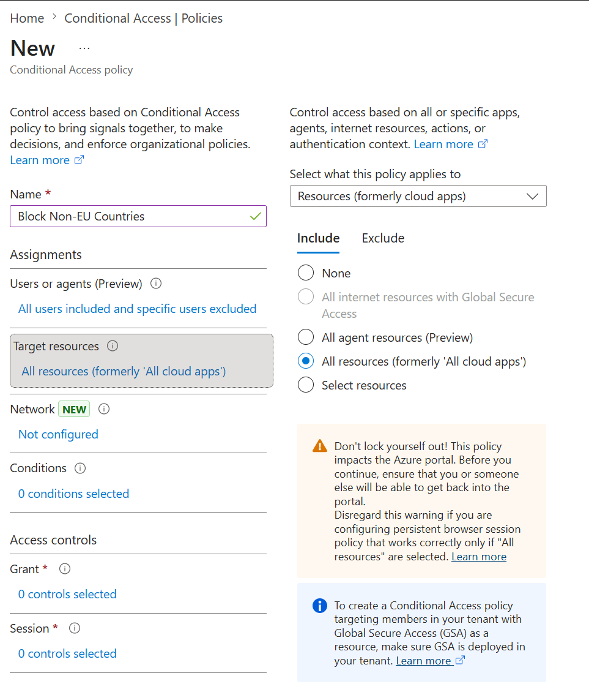

### 4.3 Policy 3: Require MFA for Admin Roles

**Purpose:** Elevated protection for privileged accounts with administrative access.

| Component | Configuration |
|-----------|---------------|
| **Users** | Directory roles: Global Administrator, Security Administrator, Conditional Access Administrator, Helpdesk Administrator |
| **Target resources** | All cloud apps |
| **Conditions** | None |
| **Access controls** | Require multifactor authentication |
| **State** | **On** |

**Rationale:** Admin accounts are high-value targets. This policy isolates privileged users with stricter enforcement regardless of device or location trust.

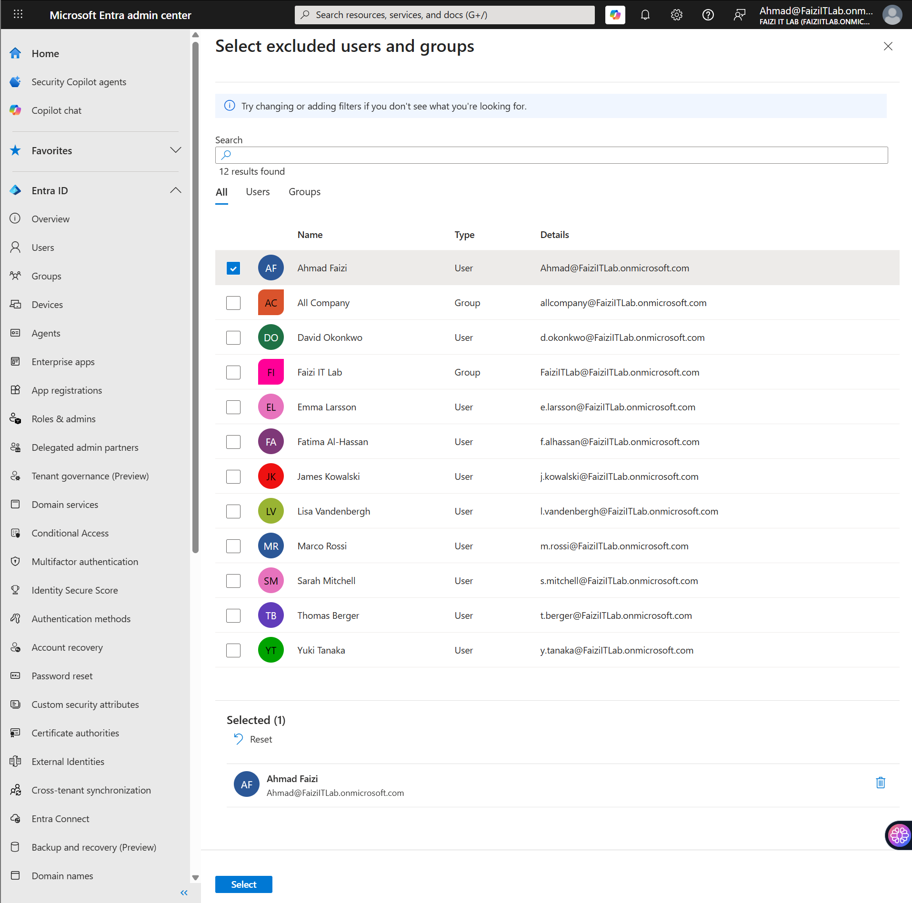

### 4.4 Policy 4: Require MFA for External and Guest Users

**Purpose:** Scoped enforcement for external collaborators and guest accounts.

| Component | Configuration |
|-----------|---------------|
| **Users** | All guests and external users |
| **Target resources** | All cloud apps |
| **Conditions** | None |
| **Access controls** | Require multifactor authentication |
| **State** | **On** |

**Rationale:** External users often have weaker home organization security postures. Requiring MFA for all guest access reduces supply-chain attack vectors.

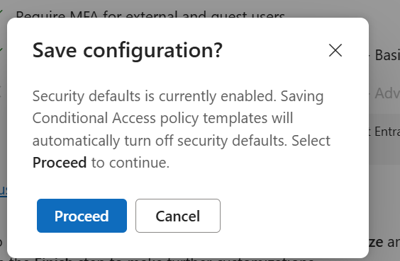

---

## 5. Conditional Access Architecture

Conditional Access acts as the **Zero Trust policy engine**, evaluating signals from Identity Protection, device compliance, location, and real-time risk to enforce access decisions.

**Signal Sources:**
- **User & group membership**
- **IP location / Named locations**
- **Device compliance state**
- **Real-time sign-in risk (Identity Protection)**
- **Client application type**

**Access Controls:**
- Block access
- Require MFA
- Require compliant device
- Require hybrid Azure AD joined device
- Require approved client app

---

## 6. Named Locations Configuration

Configured **Named locations** to define trusted geographic boundaries for Conditional Access policies:

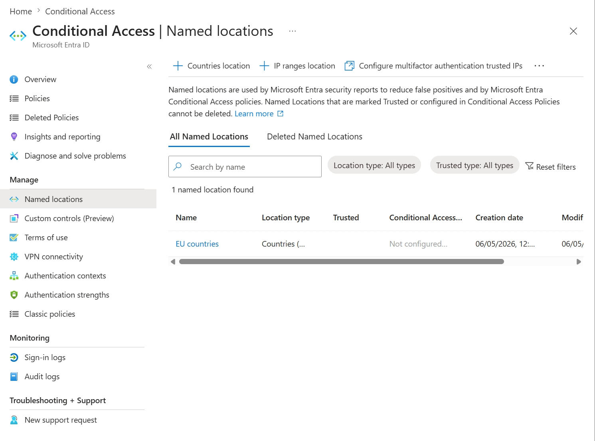

| Location | Type | Status |
|----------|------|--------|
| **EU countries** | Countries location | Trusted |
| **VPN ranges** | IP ranges | Trusted (if configured) |

---

## 7. Conditional Access Policy Dashboard

Final policy list showing all configured policies in the tenant:

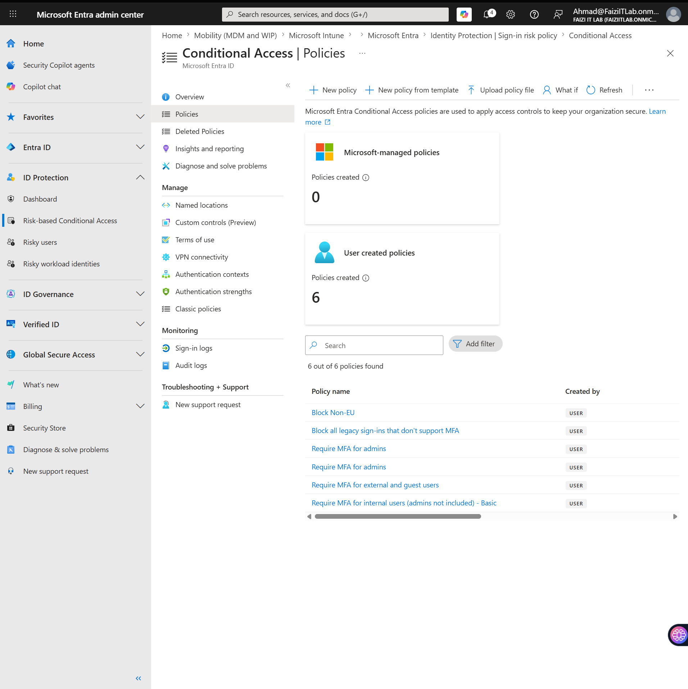

| Policy Name | State | Target |
|-------------|-------|--------|
| Block Non-EU | On | All users, block outside EU |
| Block all legacy sign-ins | On | All users, legacy protocols |
| Require MFA for admins | On | Admin roles |
| Require MFA for all users | On | All users, all cloud apps |
| Require MFA for external and guest users | On | Guest users |

---

## 8. Testing & Validation

### 8.1 What-If Tool

Used the **Conditional Access What If** tool to simulate sign-in scenarios before enabling policies:

- Simulated user: `testuser@FaziITLab.onmicrosoft.com`
- Simulated conditions: Unknown location, non-compliant device
- **Result:** Policy "Require MFA for All Users" triggered → MFA required

### 8.2 Sign-in Log Verification

Post-implementation, sign-in logs were reviewed to confirm policy application:

- **Status:** Success / Failure
- **Conditional Access:** Applied policies listed
- **MFA Result:** Completed / Interrupted

---

## 9. Key Takeaways

| Lesson | Detail |
|--------|--------|
| **Scoped Assignment** | Targeting specific users/apps prevents blanket lockouts and allows staged rollout. |
| **Geographic Restrictions** | Named locations enable blocking high-risk regions while allowing legitimate business travel. |
| **Admin Isolation** | Separate policies for admin roles ensure privileged accounts are always protected. |
| **Guest User Security** | External users should never bypass MFA — they represent the weakest link in the identity chain. |
| **Report-Only Mode** | New policies should be deployed in **Report-only** state first to measure impact before enforcement. |

---

## 10. Production Recommendations

- **Named Locations:** Define trusted office IP ranges to exempt MFA from on-premise networks (if desired).
- **Device Compliance:** Integrate with Microsoft Intune to require compliant devices in addition to MFA.
- **Session Controls:** Enforce sign-in frequency and persistent browser session limits for sensitive apps.
- **Legacy Auth Blocking:** Ensure all legacy authentication protocols are blocked — 99% of password spray attacks use these  [(CISA)](https://www.cisa.gov/resources-tools/services/m365-entra-id) .

---

## 11. References

- [Microsoft Entra Conditional Access Overview](https://learn.microsoft.com/en-us/entra/identity/conditional-access/overview)  [(Microsoft Learn)](https://learn.microsoft.com/en-us/entra/identity/conditional-access/overview) 
- [Plan a Conditional Access Deployment](https://learn.microsoft.com/en-us/entra/identity/conditional-access/plan-conditional-access)
- [Common Conditional Access Policies](https://learn.microsoft.com/en-us/entra/identity/conditional-access/concept-conditional-access-policy-common)  [(Microsoft Learn)](https://learn.microsoft.com/en-us/entra/identity/conditional-access/concept-conditional-access-policy-common) 
- [Authentication Methods Policy](https://learn.microsoft.com/en-us/entra/identity/authentication/concept-authentication-methods)
- [CISA Microsoft Entra ID Baseline Policies](https://www.cisa.gov/resources-tools/services/m365-entra-id)  [(CISA)](https://www.cisa.gov/resources-tools/services/m365-entra-id) 

---

*Lab completed: Microsoft 365 Business Premium tenant (Fazi IT Lab) with Entra ID P1 licensing.*
