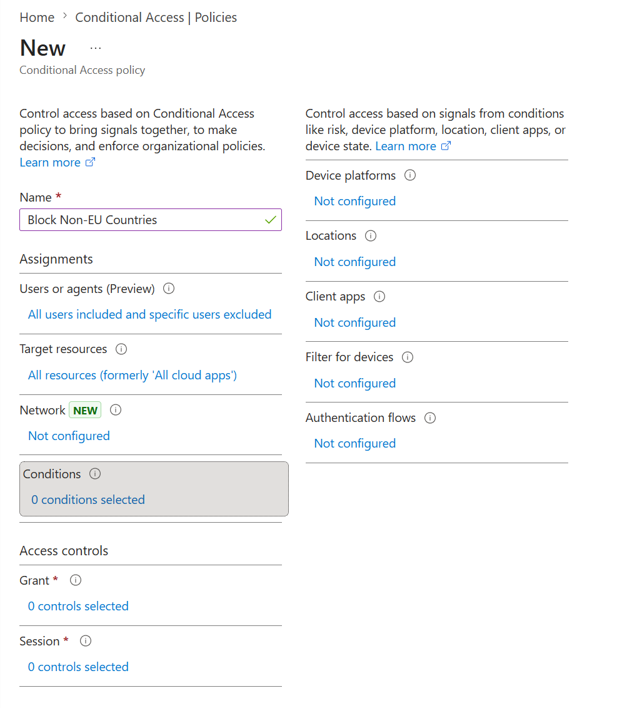
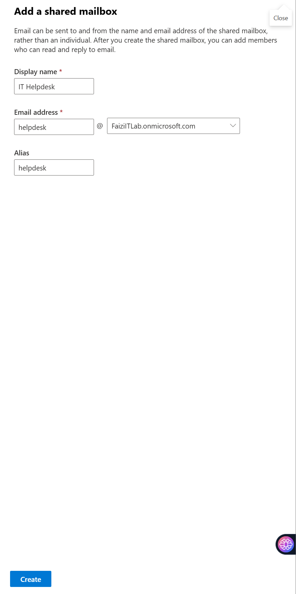

# SSPR & Identity Protection Implementation

> **Lab Environment:** Microsoft 365 Business Premium (Entra ID P1) — *Fazi IT Lab tenant*  
> **Focus:** Self-Service Password Reset (SSPR) configuration and risk-based policy design for P2-level Identity Protection.

---

## 1. Overview

This lab documents the enablement of **Self-Service Password Reset (SSPR)** to reduce helpdesk burden, and explores **Identity Protection** risk-based policies. The current tenant runs on **Business Premium (P1)**, so full risk-based Conditional Access policies requiring P2 are documented as **production-ready designs** rather than live configurations.

---

## 2. Self-Service Password Reset (SSPR)

### 2.1 SSPR Properties Configuration

SSPR was enabled for all users in the tenant with the following properties:

| Setting | Configuration |
|---------|-------------|
| **Self service password reset enabled** | **All** (applies to all end users) |
| **Authentication methods required to register** | 2 methods |
| **Methods available to users** | Mobile phone, Email, Mobile app notification, Mobile app code, Office phone, Security questions |
| **Number of questions required to register** | 3 |
| **Number of questions required to reset** | 3 |
| **Customize helpdesk link** | Enabled (links to internal IT support portal) |

> **Navigation:** *Microsoft Entra admin center* → *Protection* → *Password reset* → *Properties*

### 2.2 Authentication Methods for SSPR

Configured the specific methods users can leverage during password reset:

| Method | Status | Notes |
|--------|--------|-------|
| **Mobile phone** | ✅ Enabled | SMS or voice call verification |
| **Email** | ✅ Enabled | External email for verification code |
| **Mobile app notification** | ✅ Enabled | Microsoft Authenticator push |
| **Mobile app code** | ✅ Enabled | TOTP from Authenticator |
| **Office phone** | ❌ Disabled | Not applicable for remote workforce |
| **Security questions** | ✅ Enabled | Custom questions configured |

### 2.3 Registration Policy

Users are required to register for SSPR at sign-in. The registration experience enforces:

- Minimum **2 authentication methods** must be configured
- Methods are validated in real-time (e.g., phone number confirmed via SMS)
- Registration data is stored securely in Microsoft Entra ID

### 2.4 SSPR User Flow

When a user initiates password reset from the login page:

1. User navigates to `https://passwordreset.microsoftonline.com`
2. Enters User ID and CAPTCHA verification
3. Selects and completes primary authentication method (e.g., SMS code)
4. Selects and completes secondary authentication method (e.g., email code)
5. Enters and confirms new password
6. Password is written back to on-premises AD (if Password Writeback is enabled)

### 2.5 Password Writeback (Optional Extension)

If hybrid identity is configured with **Microsoft Entra Connect**, Password Writeback allows SSPR changes to synchronize to on-premises Active Directory:

- **Requirement:** Microsoft Entra Connect with Password Writeback enabled
- **Sync direction:** Cloud → On-premises
- **Security:** Password changes respect on-premises AD password policies

---

## 3. Identity Protection & Risk-Based Policies

### 3.1 License Constraint

> **Important:** User Risk and Sign-in Risk Conditional Access conditions require **Microsoft Entra ID P2** (included in Microsoft 365 E5 or as a standalone add-on). The current lab tenant uses **Business Premium (P1)**, which does **not** include Identity Protection risk-based policies.

### 3.2 Risk Detections Available in P1

Even without P2 policy enforcement, the following risk detections are visible in **Sign-in logs** and **Audit logs**:

| Risk Type | Description | Detectable in P1 |
|-----------|-------------|------------------|
| **Atypical travel** | Sign-in from unusual geographic location | ✅ Logged |
| **Anonymous IP address** | Sign-in from Tor/VPN/anonymous proxy | ✅ Logged |
| **Unfamiliar sign-in properties** | Sign-in with unfamiliar device/location | ✅ Logged |
| **Malware-linked IP** | Sign-in from known malicious IP | ✅ Logged |
| **Leaked credentials** | User credentials found in dark web dumps | ❌ Requires P2 |
| **Password spray** | Multiple usernames attacked with common passwords | ✅ Logged |

### 3.3 Production-Ready Risk-Based Policy Design (P2 Required)

The following policies represent the recommended configuration for a tenant with **E3/E5 or P2 licensing**:

#### Policy A: User Risk Policy

| Component | Configuration |
|-----------|---------------|
| **Target** | All users |
| **User risk level** | **High** |
| **Access control** | **Require password change** |
| **State** | On |

**Logic:** When Microsoft Entra ID Protection detects that a user's credentials are leaked or the account is compromised (High user risk), the user is forced to change their password before accessing any resource.

#### Policy B: Sign-in Risk Policy

| Component | Configuration |
|-----------|---------------|
| **Target** | All users |
| **Sign-in risk level** | **Medium and above** |
| **Access control** | **Require multifactor authentication** |
| **State** | On |

**Logic:** When a sign-in exhibits anomalous characteristics (e.g., impossible travel, anonymous IP, unfamiliar device), the session is challenged with MFA. If the legitimate user passes MFA, the risk is dismissed; if an attacker fails, access is blocked.

### 3.4 Identity Protection Portal Navigation

> **Navigation (P2 tenants):** *Microsoft Entra admin center* → *Protection* → *Identity Protection*

Available blades with P2:
- **Overview:** Dashboard of at-risk users and risky sign-ins
- **Risky users:** User-level risk history and remediation actions
- **Risky sign-ins:** Session-level risk detections
- **Risk detections:** Raw risk event feed
- **User risk policy:** Automated remediation for compromised accounts
- **Sign-in risk policy:** Real-time MFA challenge for suspicious sessions

---

## 4. SSPR + Identity Protection Integration

### 4.1 Combined Security Posture

| Layer | Control | Technology |
|-------|---------|------------|
| **Authentication** | MFA enforcement | Conditional Access (P1) |
| **Password Recovery** | Self-service reset | SSPR (P1) |
| **Compromised Account Remediation** | Forced password reset | User Risk Policy (P2) |
| **Suspicious Session Challenge** | Step-up MFA | Sign-in Risk Policy (P2) |

### 4.2 End-to-End User Scenario

1. **Normal user** signs in with password + MFA (CA policy)
2. **User forgets password** → initiates SSPR, verifies via 2 methods, resets password
3. **Leaked credentials detected** → Identity Protection flags High user risk → User Risk Policy forces password change at next sign-in
4. **Attacker signs in from Tor exit node** → Sign-in Risk Policy detects Medium risk → challenges with MFA → attacker fails → sign-in blocked

---

## 5. Testing & Validation

### 5.1 SSPR Testing

- Created test user with registered authentication methods
- Navigated to password reset portal and completed full flow
- Verified password change reflected in Microsoft Entra ID within seconds

### 5.2 Risk Detection Review (P1)

- Reviewed **Sign-in logs** → *Authentication Details* → *Risk level*
- Confirmed risk detections (e.g., "Unfamiliar sign-in properties") are logged but do **not** trigger automated policy actions without P2

---

## 6. Key Takeaways

| Lesson | Detail |
|--------|--------|
| **SSPR Reduces IT Burden** | ~30% of helpdesk tickets are password-related; SSPR eliminates most. |
| **Multi-Method Requirement** | Requiring 2+ methods ensures users have backup options if one fails. |
| **P2 for Risk Automation** | Without P2, risk detections are informational only. Automated response requires upgrading to E5 or adding P2 licenses. |
| **Password Writeback** | Essential for hybrid environments; otherwise cloud-only passwords create sync conflicts. |
| **Custom Helpdesk Link** | Redirects confused users to internal support, reducing abandonment during SSPR flow. |

---

## 7. Production Recommendations

- **SSPR Scope:** Start with a pilot group before enabling tenant-wide to ensure registration compliance.
- **Passwordless Transition:** Gradually move SSPR-registered users to **Passwordless (FIDO2 / Authenticator)** to eliminate passwords entirely.
- **P2 Upgrade Path:** Plan migration to Microsoft 365 E5 or add Entra ID P2 licenses for:
  - Automated user risk remediation
  - Real-time sign-in risk challenges
  - Access Reviews and Privileged Identity Management (PIM)
- **Monitoring:** Configure **Diagnostic Settings** to stream Identity Protection logs to Log Analytics or Sentinel for custom alerting.

---

## 8. References

- [Enable Microsoft Entra Self-Service Password Reset](https://learn.microsoft.com/en-us/entra/identity/authentication/tutorial-enable-sspr)
- [How SSPR Works](https://learn.microsoft.com/en-us/entra/identity/authentication/concept-sspr-howitworks)
- [Microsoft Entra ID Protection Overview](https://learn.microsoft.com/en-us/entra/id-protection/overview)
- [Identity Protection Risk-Based Policies](https://learn.microsoft.com/en-us/entra/id-protection/concept-identity-protection-policies)
- [Plan a Conditional Access Deployment](https://learn.microsoft.com/en-us/entra/identity/conditional-access/plan-conditional-access)
- [Microsoft 365 Licensing for Identity Protection](https://learn.microsoft.com/en-us/entra/id-protection/overview-identity-protection#license-requirements)

---

*Lab completed: Microsoft 365 Business Premium tenant (Fazi IT Lab). Risk-based policies documented as P2 production designs.*
