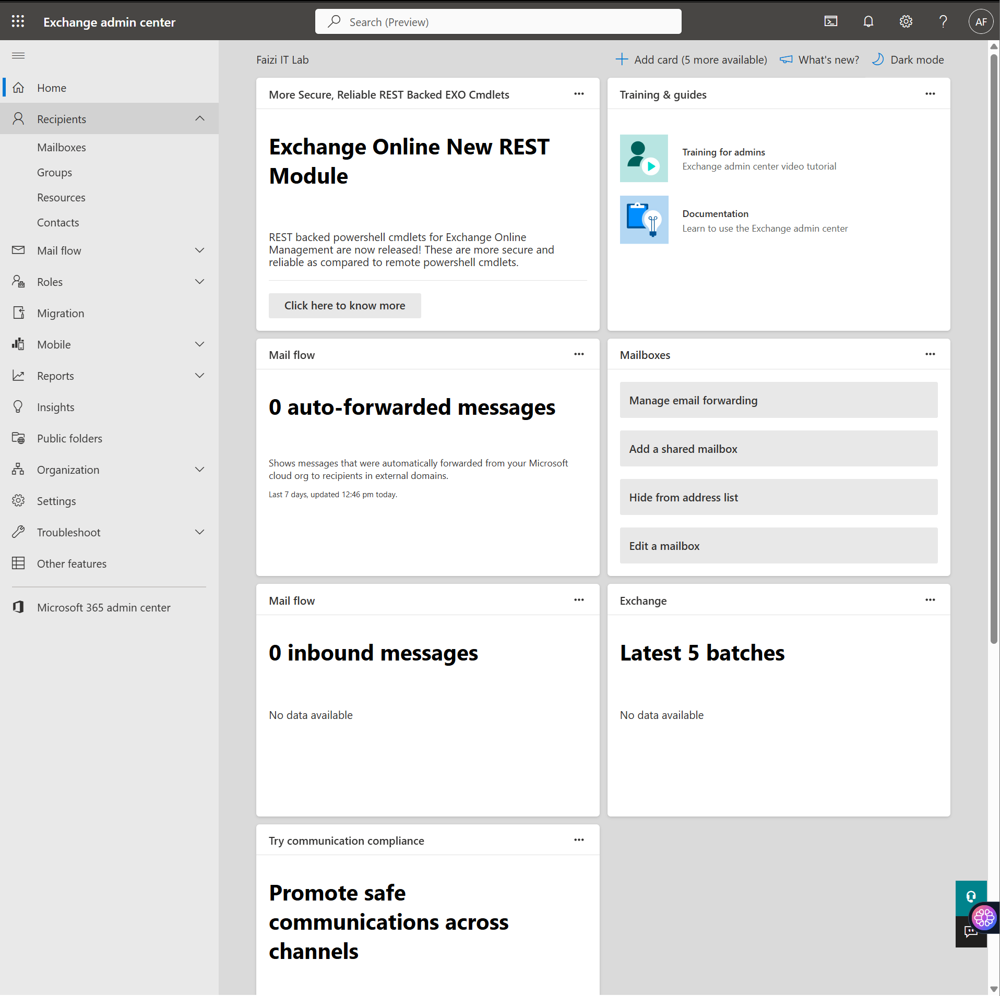
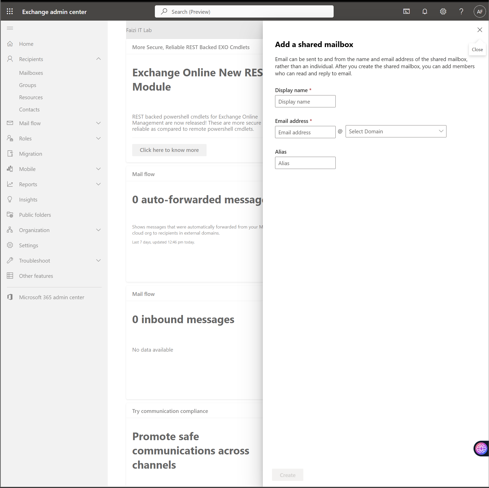
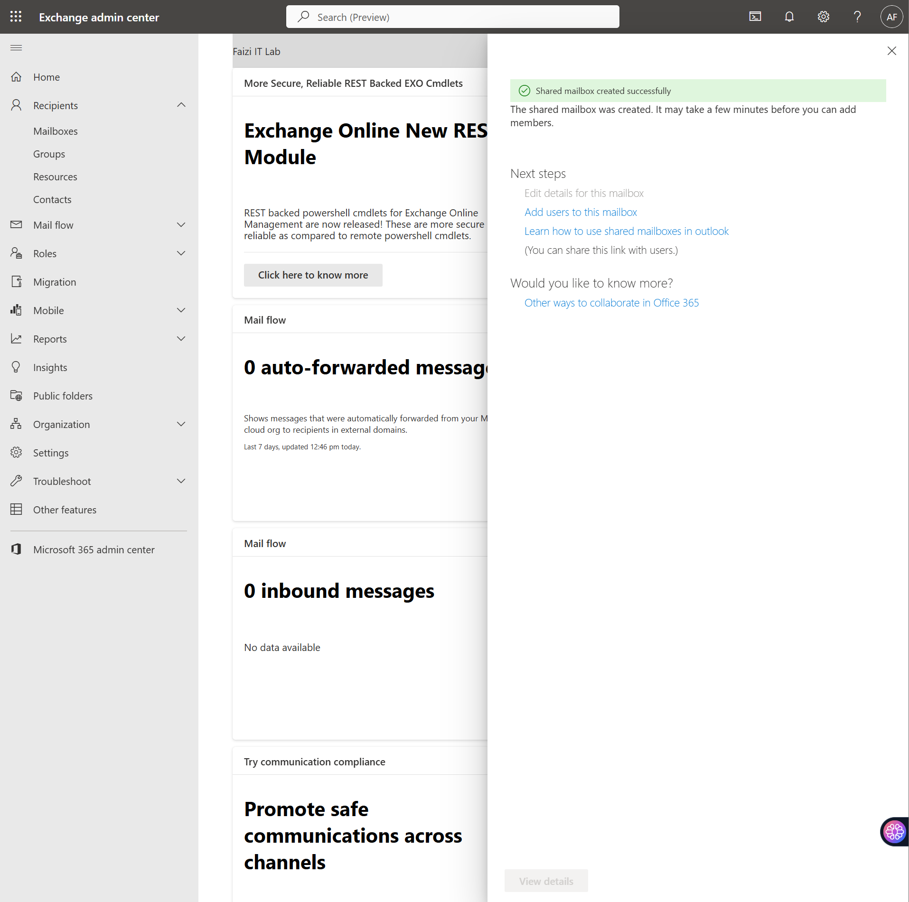
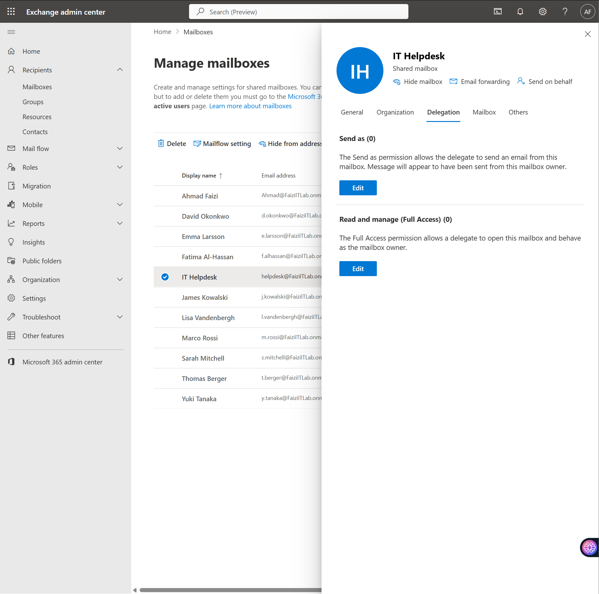
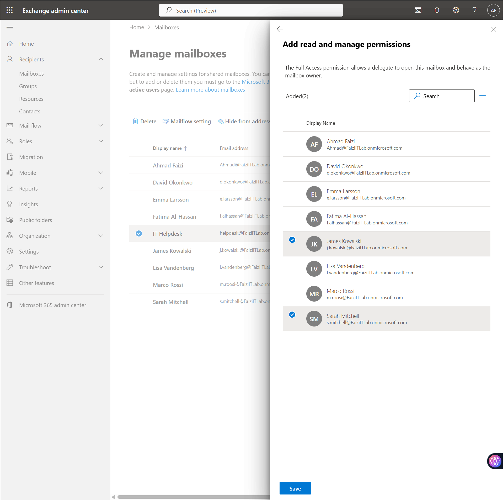
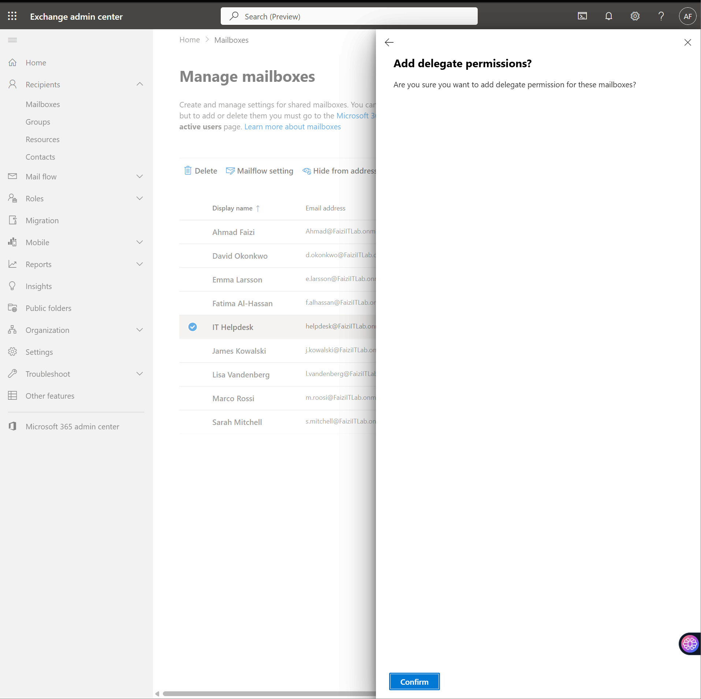
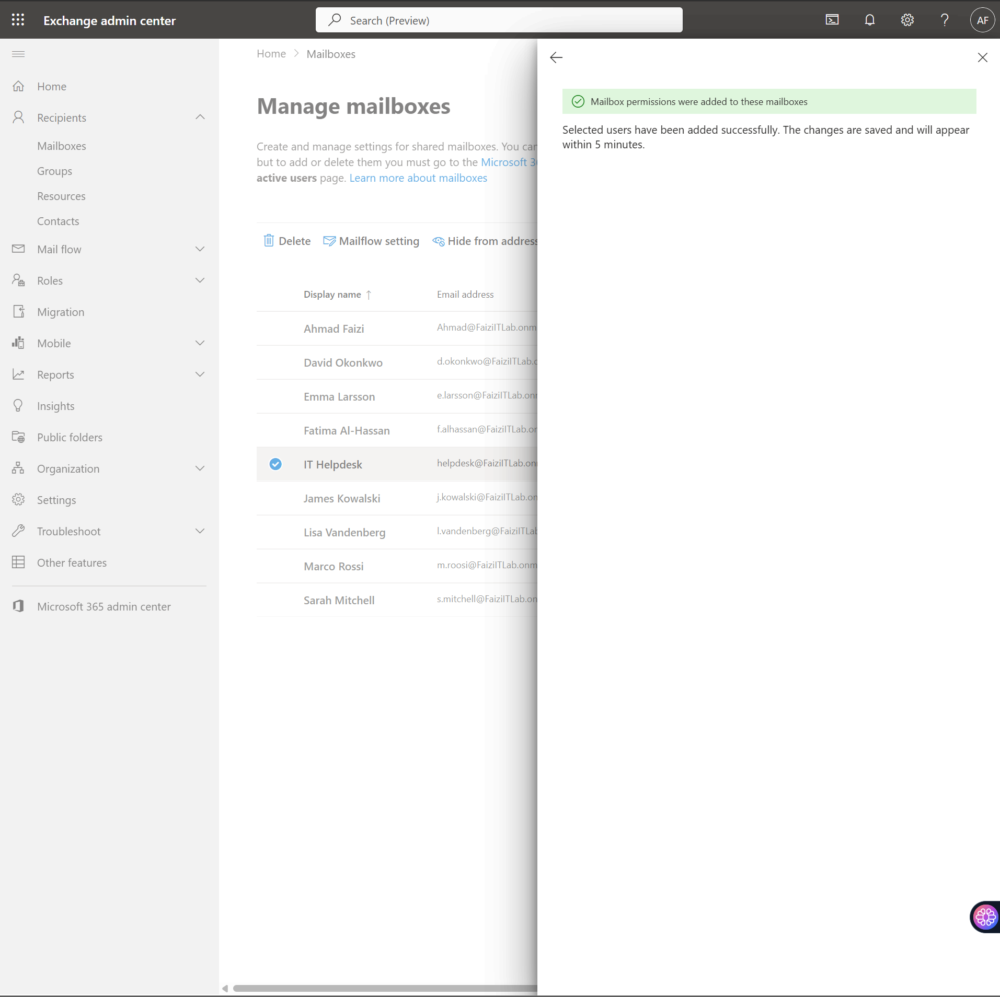
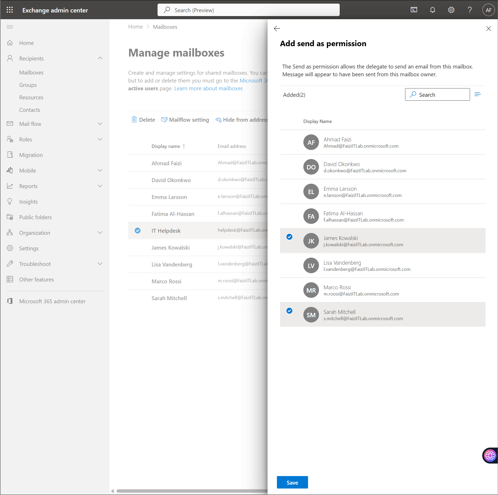
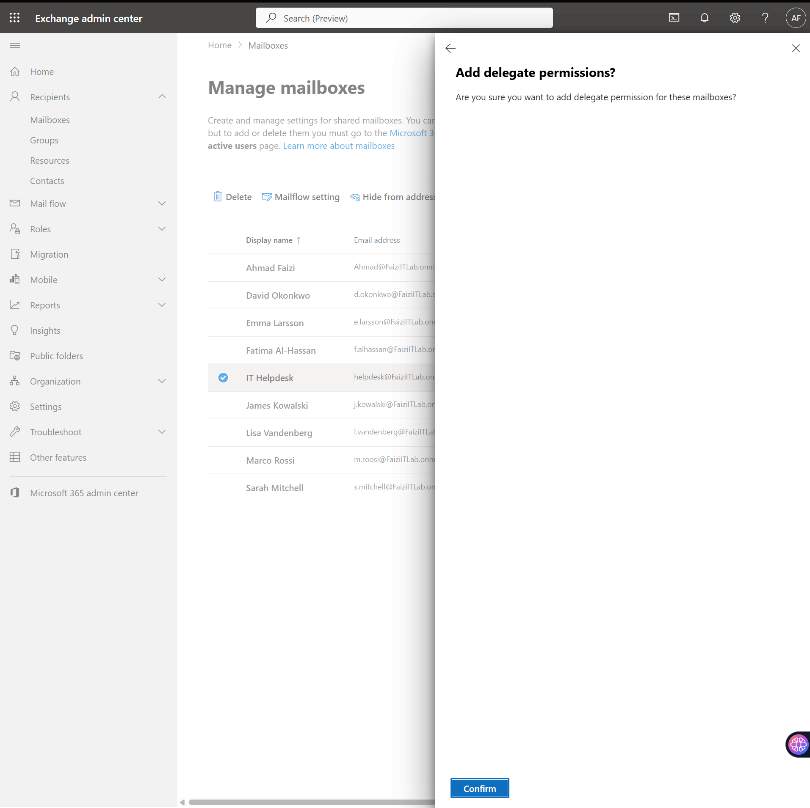

# Shared Mailboxes & Email Aliases

> **Lab Environment:** Microsoft 365 Business Premium — *Fazi IT Lab tenant*  
> **Focus:** Creating shared mailboxes, configuring delegate permissions, and managing email aliases for departmental communication.

---

## 1. Overview

This lab documents the creation and configuration of **shared mailboxes** in Exchange Online. Shared mailboxes enable teams to monitor and send email from a common address (e.g., helpdesk@company.com) without requiring separate user licenses. The lab also covers **delegate permissions** for mailbox access and **email aliases** for flexible addressing.

---

## 2. Exchange Admin Center Navigation

### 2.1 Accessing Exchange Admin Center

Navigated to the **Exchange admin center** from the Microsoft 365 admin center to manage mailboxes and mail flow.

The Exchange admin center provides centralized management for:
- Recipients (mailboxes, groups, contacts)
- Mail flow (rules, connectors, accepted domains)
- Security & compliance (retention, auditing)
- Permissions (admin roles, delegation)

---

## 3. Shared Mailbox Creation

### 3.1 Creating a Shared Mailbox

Created a new shared mailbox for the IT Helpdesk team.

**Mailbox Details:**
| Attribute | Value |
|-----------|-------|
| **Display name** | IT Helpdesk |
| **Email address** | helpdesk@FaziITLab.onmicrosoft.com |
| **Alias** | helpdesk |

> **Navigation:** *Exchange admin center* → *Recipients* → *Mailboxes* → *Add a shared mailbox*

### 3.2 Configuring Email Aliases

Added an additional email alias to the shared mailbox for alternative addressing.

| Alias | Purpose |
|-------|---------|
| `helpdesk` | Primary address |
| `support` | Secondary alias for user familiarity |

### 3.3 Mailbox Creation Confirmation

The shared mailbox was successfully created and appeared in the mailbox list.

---

## 4. Delegate Permissions

### 4.1 Assigning Full Access Permissions

Granted **Full Access** permissions to designated team members so they can open, read, and manage emails in the shared mailbox.

**Permission Types:**
| Permission | Description |
|-----------|-------------|
| **Full Access** | User can open the mailbox and behave as the mailbox owner |
| **Send As** | User can send email that appears to come from the shared mailbox |
| **Send on Behalf** | User can send email on behalf of the shared mailbox (shows "Sent on behalf of") |

### 4.2 Assigning Send As Permissions

Configured **Send As** permissions so helpdesk staff can respond to tickets from the shared mailbox address.

### 4.3 Permission Verification

Verified that all delegated permissions were applied successfully.

---

## 5. Managing Shared Mailboxes

### 5.1 Mailbox Properties

Reviewed and configured additional properties for the shared mailbox.

| Setting | Configuration |
|---------|-------------|
| **Hide from address list** | No (visible in GAL for easy discovery) |
| **Mailbox size limit** | 50 GB (default for shared mailboxes) |
| **Retention policy** | Default MRM policy |
| **Litigation hold** | Disabled |

### 5.2 Mailbox Delegation Dashboard

The delegation settings show all users with access to the shared mailbox and their permission levels.

### 5.3 Editing Delegates

Added additional delegates and modified existing permissions as team membership changed.

### 5.4 Delegate Confirmation

Confirmed delegate permissions were saved and applied.

---

## 6. Shared Mailbox List

### 6.1 All Shared Mailboxes Overview

Reviewed the complete list of shared mailboxes in the organization.

| Mailbox | Email Address | Delegates |
|---------|--------------|-----------|
| IT Helpdesk | helpdesk@faziitlab.onmicrosoft.com | Ahmad Fazi, Sarah Mitchell |
| All Company | allcompany@faziitlab.onmicrosoft.com | All users |
| Fazi IT Lab | faziitlab@faziitlab.onmicrosoft.com | Admin team |

---

## 7. Key Takeaways

| Lesson | Detail |
|--------|--------|
| **No License Required** | Shared mailboxes don't require separate Microsoft 365 licenses when under 50 GB. |
| **Delegate Management** | Full Access + Send As is the standard combination for helpdesk-style shared mailboxes. |
| **Aliases Flexibility** | Multiple aliases allow users to reach the same mailbox via different addresses (e.g., helpdesk, support, it-support). |
| **GAL Visibility** | Keeping shared mailboxes visible in the Global Address List helps users discover them. |
| **Security Consideration** | Regularly audit delegate permissions — excessive Full Access grants increase insider threat risk. |

---

## 8. Production Recommendations

- **Auto-Mapping:** Enable auto-mapping so shared mailboxes automatically appear in delegates' Outlook profiles.
- **Retention Policies:** Apply custom retention policies to shared mailboxes based on content sensitivity (e.g., 1-year deletion for general support, 7-year hold for legal-related).
- **Litigation Hold:** Enable litigation hold on critical shared mailboxes (e.g., legal@, compliance@) before any anticipated disputes.
- **Mailbox Auditing:** Enable mailbox auditing to track delegate actions (read, delete, send) for compliance.
- **Naming Convention:** Use consistent naming (e.g., `SH-MBX-Department-Name`) for easier management at scale.

---

## 9. References

- [Create a Shared Mailbox in Exchange Online](https://learn.microsoft.com/en-us/exchange/collaboration/shared-mailboxes/create-shared-mailboxes)
- [Configure Shared Mailbox Permissions](https://learn.microsoft.com/en-us/exchange/collaboration/shared-mailboxes/configure-shared-mailbox-permissions)
- [Exchange Online Mailbox Limits](https://learn.microsoft.com/en-us/office365/servicedescriptions/exchange-online-service-description/exchange-online-limits#mailbox-storage-limits)
- [Mailbox Auditing in Exchange Online](https://learn.microsoft.com/en-us/purview/audit-log-mailbox)

---

*Lab completed: Exchange Online tenant (Fazi IT Lab) with shared mailboxes, aliases, and delegate permissions configured.*
