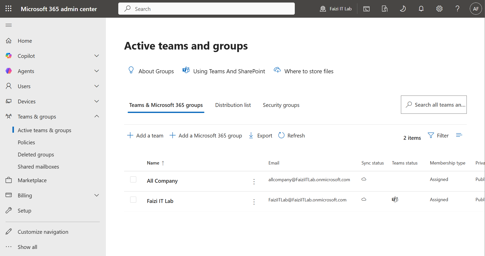
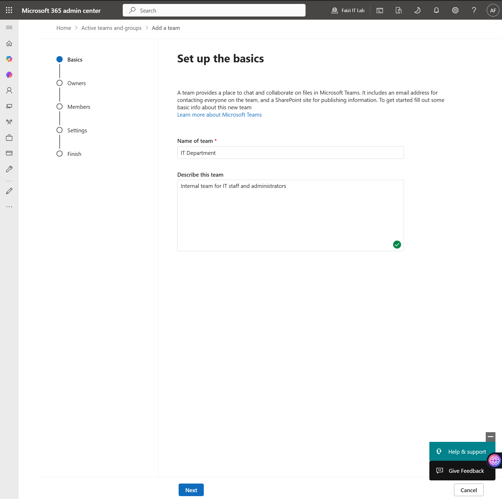
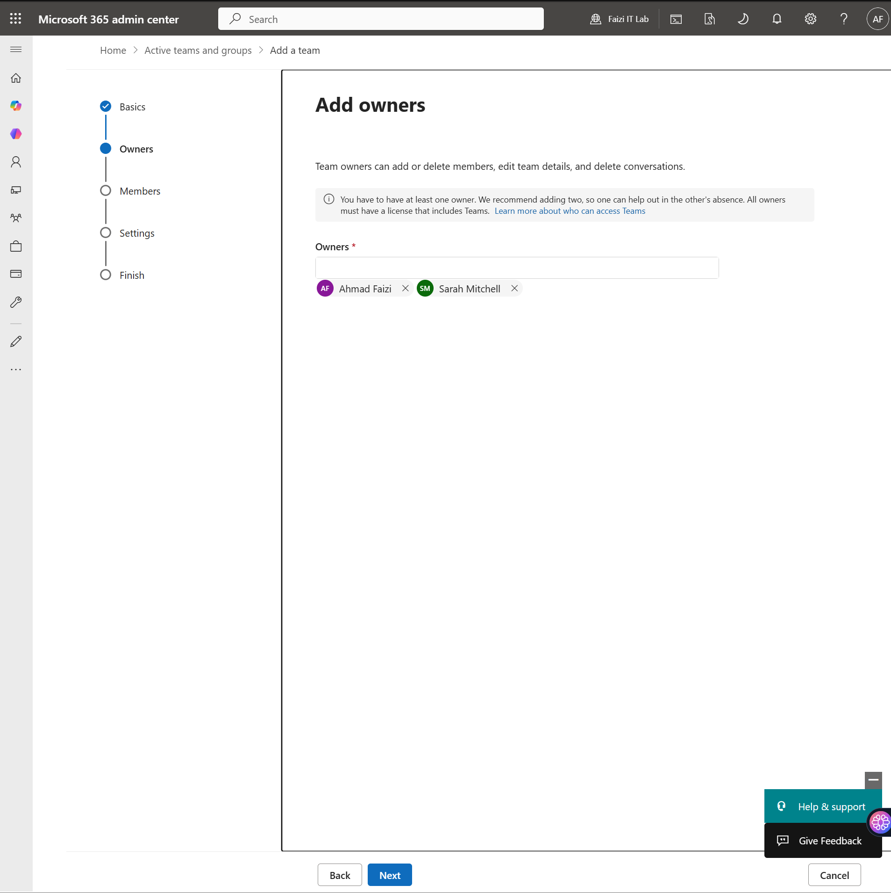
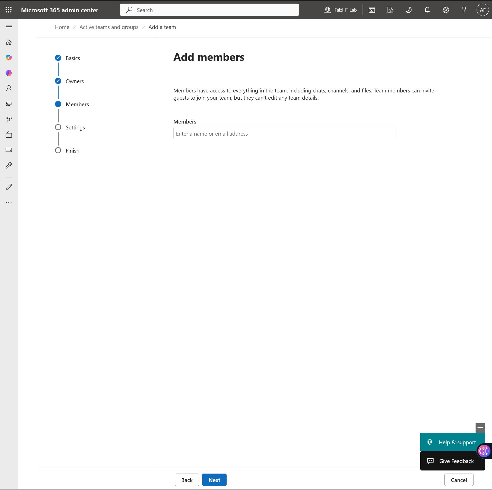
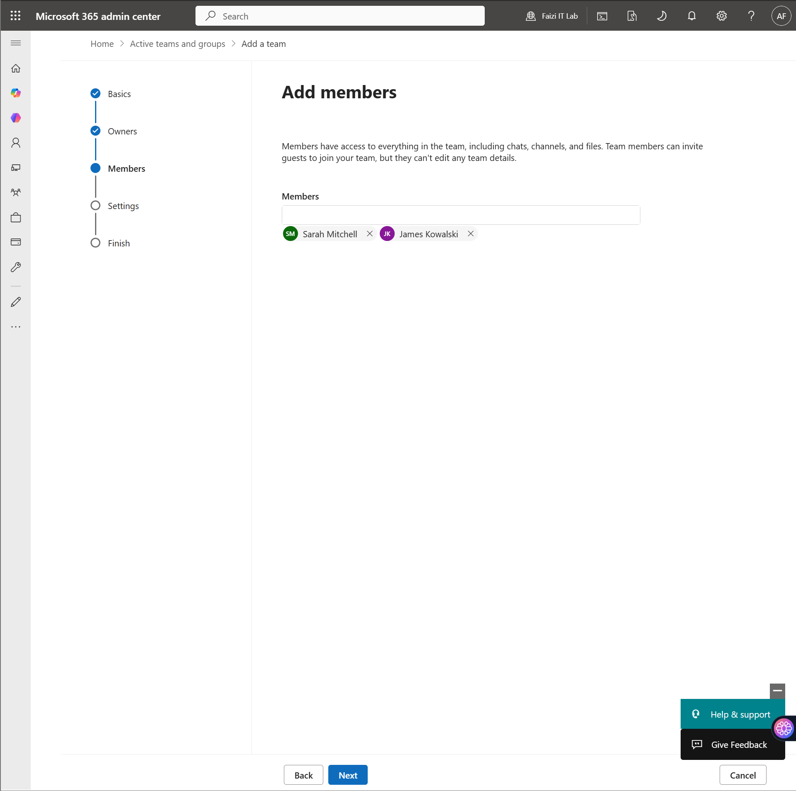
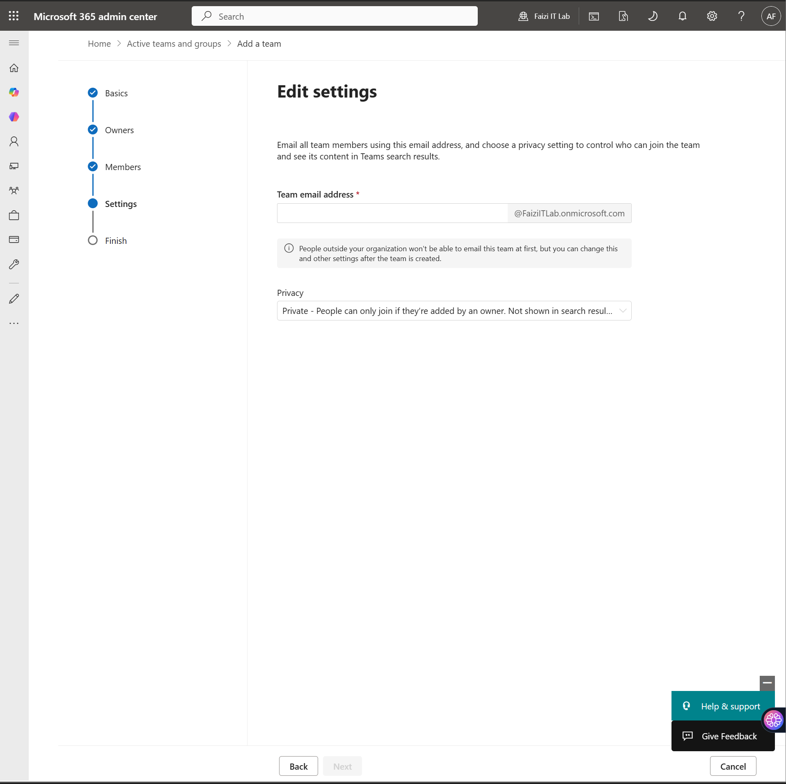
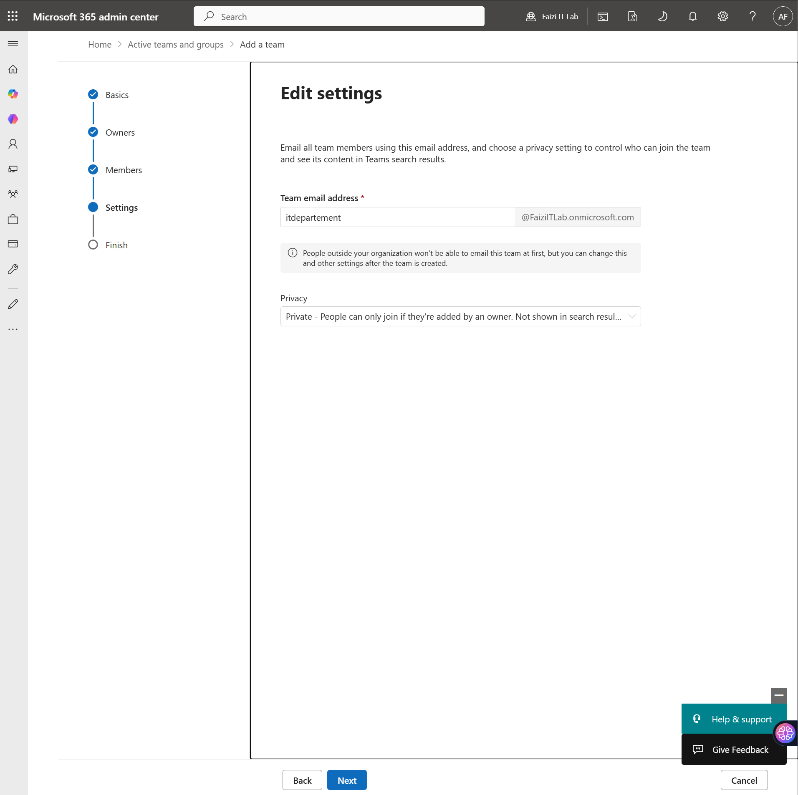
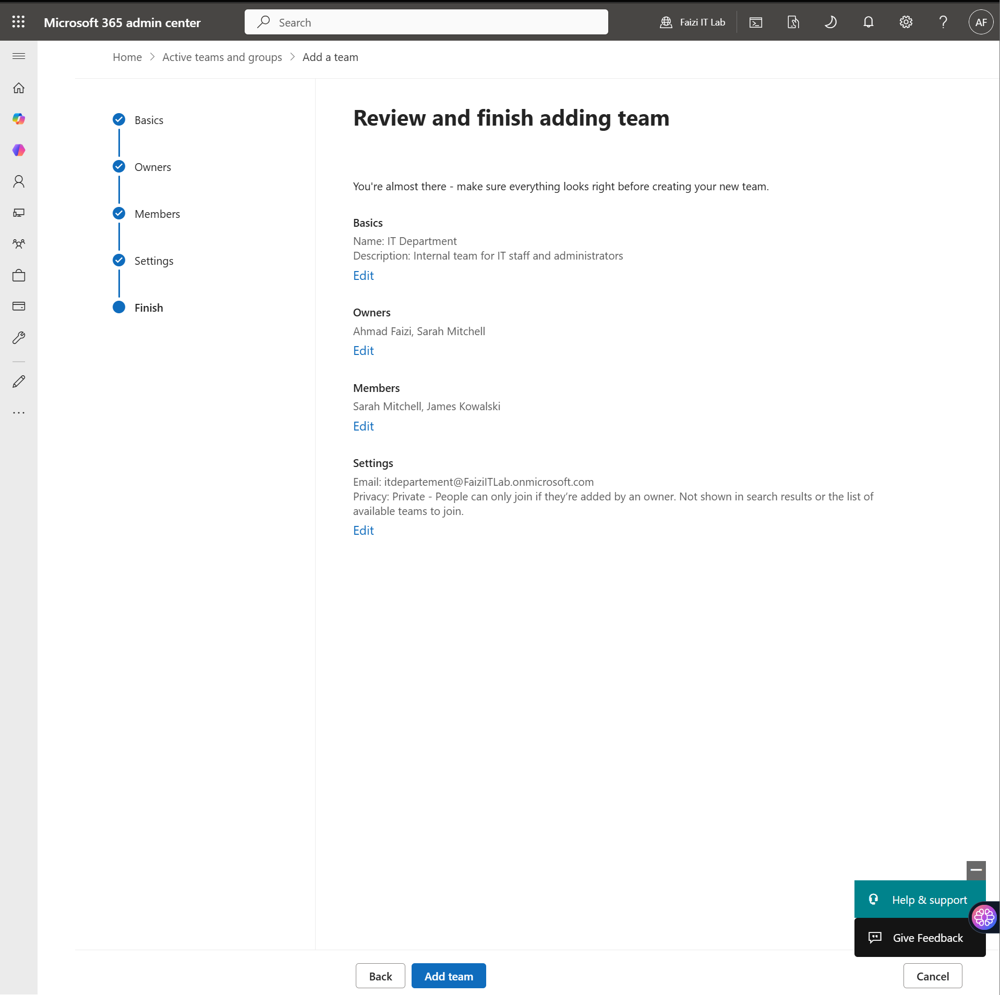
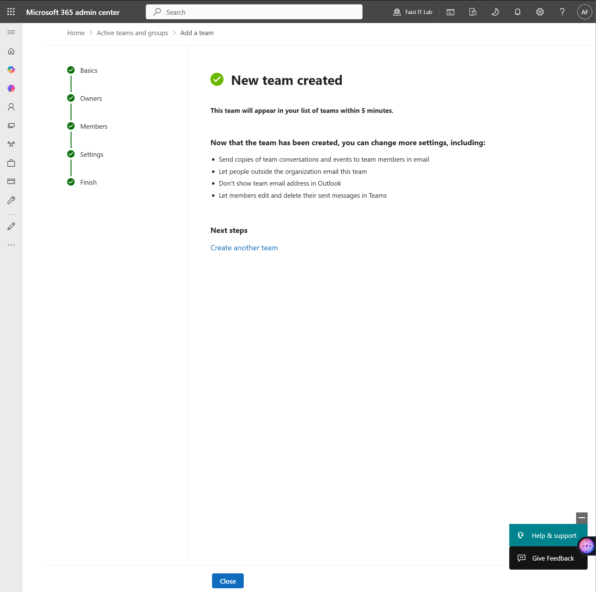
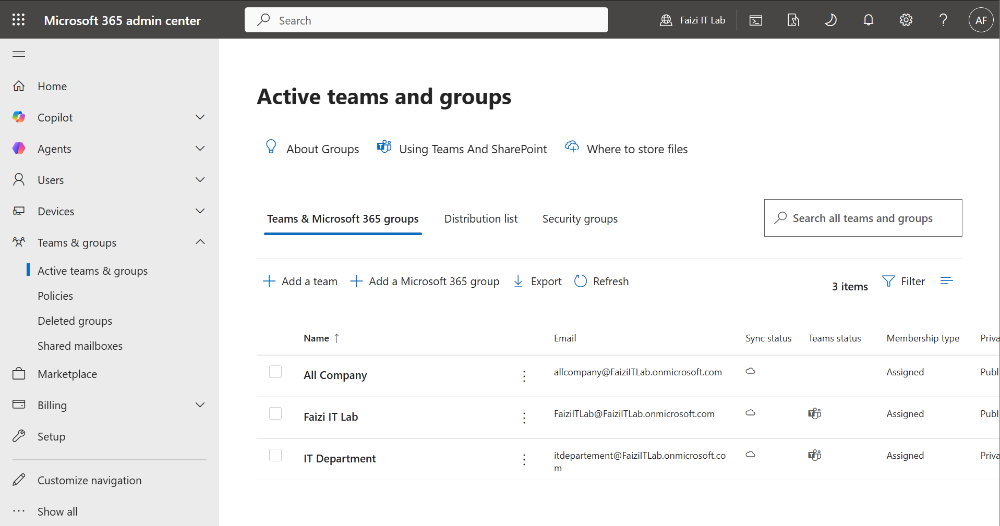

# Teams & Channel Configuration

> **Lab Environment:** Microsoft 365 Business Premium — *Fazi IT Lab tenant*  
> **Focus:** Creating Microsoft Teams teams, configuring ownership and membership, and setting up channels for departmental collaboration.

---

## 1. Overview

This lab documents the creation and configuration of **Microsoft Teams** as the central collaboration hub for the organization. Teams were created for departments, with appropriate owners, members, and privacy settings to ensure secure and effective communication.

---

## 2. Teams Admin Center

### 2.1 Accessing Teams Management

Navigated to the **Microsoft 365 admin center** to manage teams and groups.

> **Navigation:** *Microsoft 365 admin center* → *Teams & groups* → *Active teams & groups*

The admin center shows all teams with their:
- Name and email address
- Team status (Active/Archived)
- Membership type (Assigned/Dynamic)
- Privacy setting (Public/Private)

---

## 3. Creating a New Team

### 3.1 Starting Team Creation

Created a new team for the IT Department.

**Team Details:**
| Attribute | Value |
|-----------|-------|
| **Name** | IT Department |
| **Description** | Internal team for IT staff and administrators |
| **Privacy** | Private |
| **Email address** | itdepartment@faziitlab.onmicrosoft.com |

### 3.2 Setting Up Basics

Configured the foundational team properties.

| Setting | Value |
|---------|-------|
| **Name of team** | IT Department |
| **Description** | Internal team for IT staff and administrators |
| **Sensitivity label** | None |

### 3.3 Adding Owners

Assigned team owners who can manage membership, settings, and content.

| Owner | Role |
|-------|------|
| Ahmad Fazi | Primary administrator |
| Sarah Mitchell | Backup administrator |

### 3.4 Adding Members

Added team members who participate in collaboration.

| Member | Department |
|--------|------------|
| Sarah Mitchell | IT |
| James Knowleski | IT |

### 3.5 Edit Settings

Configured team privacy and discovery settings.

| Setting | Value |
|---------|-------|
| **Privacy** | Private — People can only join if they're added by an owner |
| **Searchable** | Not shown in search results |

### 3.6 Settings Confirmation

Reviewed the configured settings before finalizing.

### 3.7 Review and Finish

Final review of the IT Department team configuration.

| Component | Configuration |
|-----------|---------------|
| **Name** | IT Department |
| **Description** | Internal team for IT staff and administrators |
| **Owners** | Ahmad Fazi, Sarah Mitchell |
| **Members** | Sarah Mitchell, James Knowleski |
| **Privacy** | Private |
| **Email** | itdepartment@faziitlab.onmicrosoft.com |

### 3.8 Team Created Successfully

The IT Department team was created and became available in Teams within 15 minutes.

---

## 4. Teams Dashboard

### 4.1 All Teams Overview

Reviewed the complete list of teams in the organization.

| Team Name | Email Address | Privacy | Members |
|-----------|--------------|---------|---------|
| All Company | allcompany@faziitlab.onmicrosoft.com | Public | All users |
| Fazi IT Lab | faziitlab@faziitlab.onmicrosoft.com | Public | Admin team |
| IT Department | itdepartment@faziitlab.onmicrosoft.com | Private | IT staff |

---

## 5. Channel Configuration (Conceptual)

### 5.1 Standard Channels

For each team, the following standard channels were configured:

| Channel | Purpose |
|---------|---------|
| **General** | Default channel for announcements and general discussion |
| **Projects** | Active project coordination and status updates |
| **Incidents** | IT incident tracking and resolution |
| **Documentation** | Shared technical documentation and SOPs |

### 5.2 Channel Settings

| Setting | Configuration |
|---------|-------------|
| **Moderation** | Enabled for General channel (only owners can post) |
| **File tabs** | Connected to SharePoint document libraries |
| **App tabs** | Planner for project tracking, OneNote for notes |
| **Guest access** | Disabled for sensitive teams |

---

## 6. Team Governance

### 6.1 Privacy Settings

| Team Type | Privacy | Rationale |
|-----------|---------|-----------|
| **All Company** | Public | Everyone should have access to company-wide announcements |
| **Fazi IT Lab** | Public | General collaboration and knowledge sharing |
| **IT Department** | Private | Restricted to IT staff for sensitive operational discussions |

### 6.2 Membership Management

- **Assigned membership** — Owners manually add/remove members
- **Dynamic membership** — Not used in this lab (requires Entra ID P1/P2)
- **Guest access** — Disabled tenant-wide for security

---

## 7. Key Takeaways

| Lesson | Detail |
|--------|--------|
| **Private vs. Public** | Private teams prevent unauthorized access to sensitive departmental content; public teams foster open collaboration. |
| **Owner Responsibility** | Team owners control membership and content moderation — assign at least 2 owners for redundancy. |
| **Email Integration** | Every team has an associated email address and SharePoint site, enabling cross-platform collaboration. |
| **Channel Moderation** | Enabling moderation in the General channel prevents noise and ensures important announcements aren't buried. |
| **Naming Convention** | Consistent team naming (e.g., `Department-Name`) improves discoverability and admin efficiency. |

---

## 8. Production Recommendations

- **Sensitivity Labels:** Apply sensitivity labels to teams handling confidential data (e.g., `Finance`, `HR`, `Legal`).
- **Retention Policies:** Configure Teams retention policies to archive or delete messages after defined periods.
- **Guest Access Governance:** If guest access is required, use Entra ID Access Reviews to periodically validate external membership.
- **Private Channel Usage:** Use private channels within teams for sub-groups that need restricted access to specific content.
- **Teams Templates:** Create custom team templates for consistent provisioning (e.g., "Project Team", "Department Team").
- **Monitoring:** Use Teams admin reports to track user activity, app usage, and meeting quality.

---

## 9. References

- [Create a Team in Microsoft Teams](https://learn.microsoft.com/en-us/microsoftteams/create-a-team)
- [Manage Teams in Microsoft 365 Admin Center](https://learn.microsoft.com/en-us/microsoftteams/manage-teams-in-modern-portal)
- [Teams Privacy and Security](https://learn.microsoft.com/en-us/microsoftteams/teams-security-guide)
- [Teams Retention Policies](https://learn.microsoft.com/en-us/microsoftteams/retention-policies)
- [Teams Guest Access](https://learn.microsoft.com/en-us/microsoftteams/guest-access)

---

*Lab completed: Microsoft 365 tenant (Fazi IT Lab) with Teams teams, owners, members, and privacy settings configured.*
