# Enrollment & Compliance Policies

> **Lab Environment:** Microsoft 365 Business Premium — *Faizi-IT BV tenant*  
> **Focus:** Windows Autopilot enrollment, device compliance policies, and the Enrollment Status Page (ESP) configuration.

---

## 1. Overview

This lab documents the configuration of **Microsoft Intune** device enrollment and compliance policies. The goal is to ensure that only managed, compliant devices can access organizational resources through Conditional Access integration.

---

## 2. Intune Tenant Setup

### 2.1 Accessing the Intune Admin Center

Navigated to the Microsoft Intune admin center from the Microsoft Entra admin center to begin device management configuration.

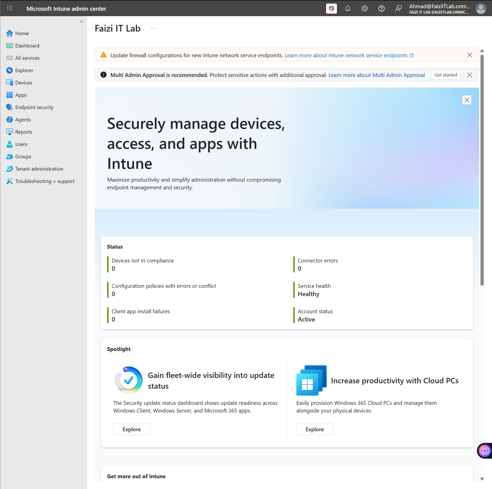

### 2.2 MDM Authority Configuration

Configured the Mobile Device Management (MDM) authority in Microsoft Entra ID to point to Microsoft Intune:

| Setting | Value |
|---------|-------|
| **MDM user scope** | All |
| **MAM user scope** | None |
| **MDM terms of use URL** | Default Microsoft URL |
| **MDM discovery URL** | `https://enrollment.manage.microsoft.com/enrollmentserver/discovery.svc` |
| **MDM compliance URL** | `https://portal.manage.microsoft.com/?portalAction=Compliance` |

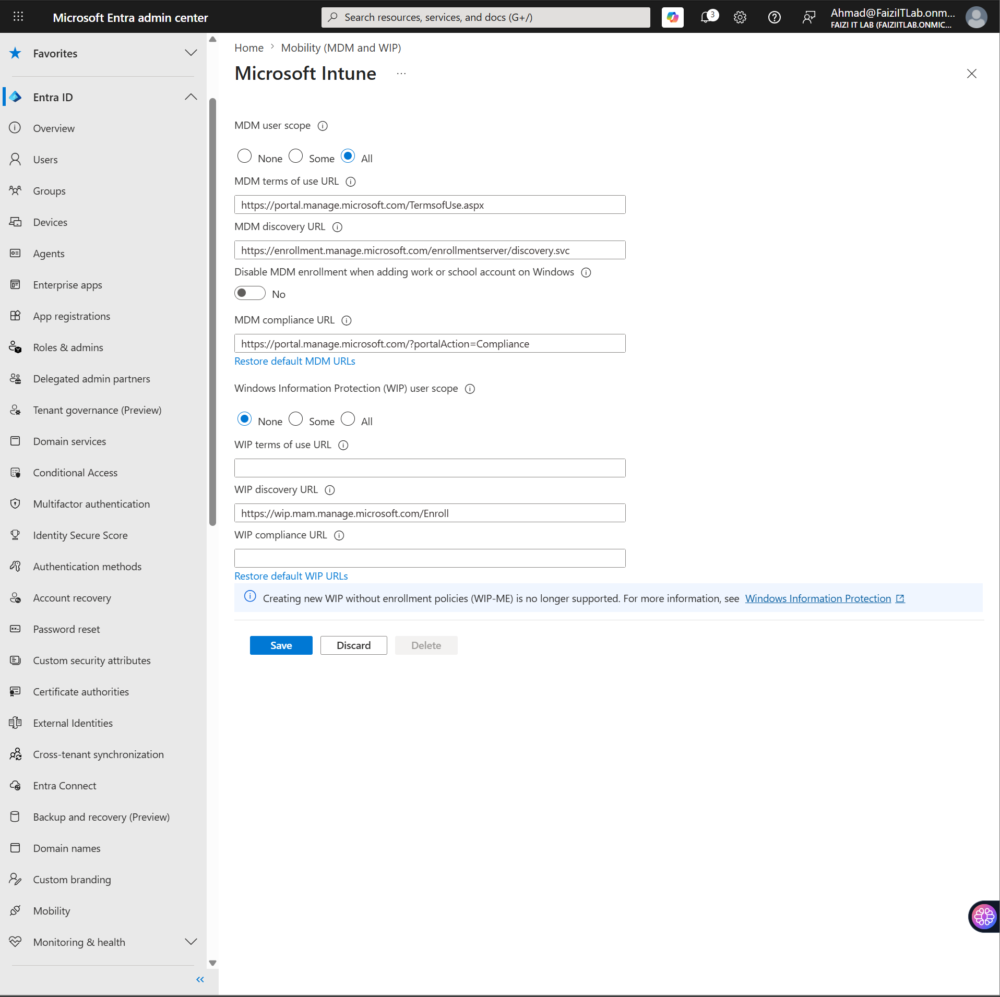

> **Navigation:** *Microsoft Entra admin center* → *Mobility (MDM and MAM)* → *Microsoft Intune*

---

## 3. Windows Enrollment Configuration

### 3.1 Enrollment Status Page (ESP)

Configured the **Enrollment Status Page** to display during device setup, showing users the progress of app and profile installation.

| ESP Setting | Configuration |
|-------------|---------------|
| **Show app and profile configuration progress** | Yes |
| **Show an error when installation takes longer than specified number of minutes** | 60 minutes |
| **Show custom message when time limit error occurs** | Yes |
| **Turn on log collection and diagnostics page for end users** | Yes |
| **Only show page to devices provisioned by out-of-box experience (OOBE)** | Yes |
| **Install Windows updates (might restart the device)** | Yes |
| **Block device use until all apps and profiles are installed** | Yes |
| **Allow users to reset device if installation error occurs** | No |
| **Allow users to use device if installation error occurs** | No |

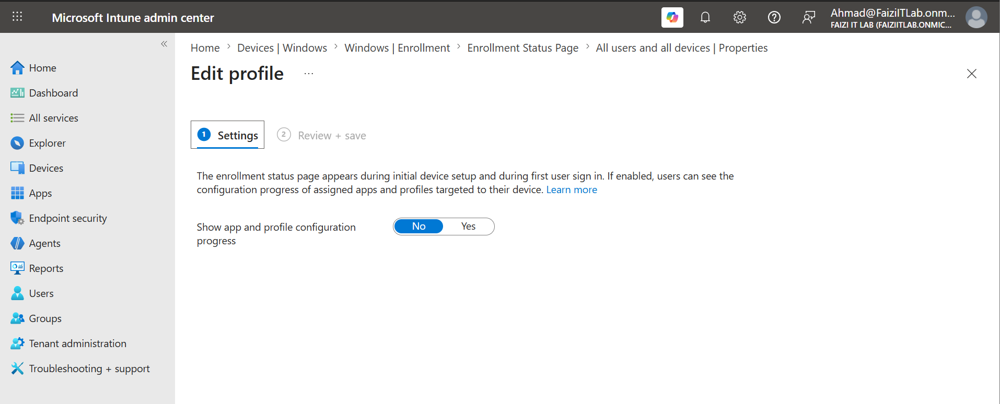

### 3.2 ESP Assignment

Assigned the Enrollment Status Page configuration to **All users and all devices** for broad coverage.

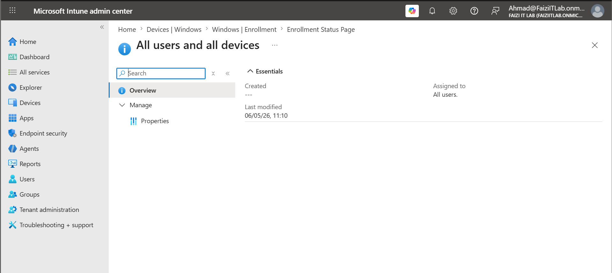

### 3.3 ESP Properties Review

Reviewed the default ESP profile properties to confirm settings were applied correctly.

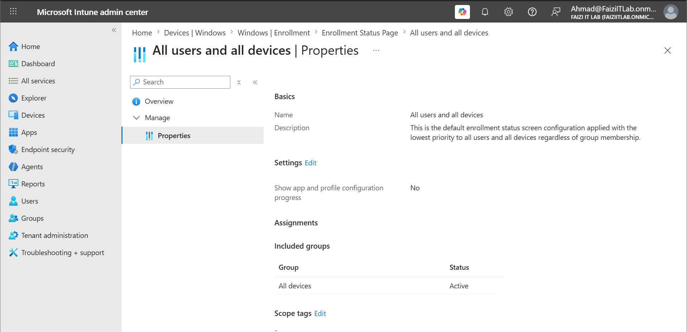

---

## 4. Device Compliance Policies

### 4.1 Creating a Windows 10/11 Compliance Policy

Created a new compliance policy targeting **Windows 10 and later** devices with security-hardened settings.

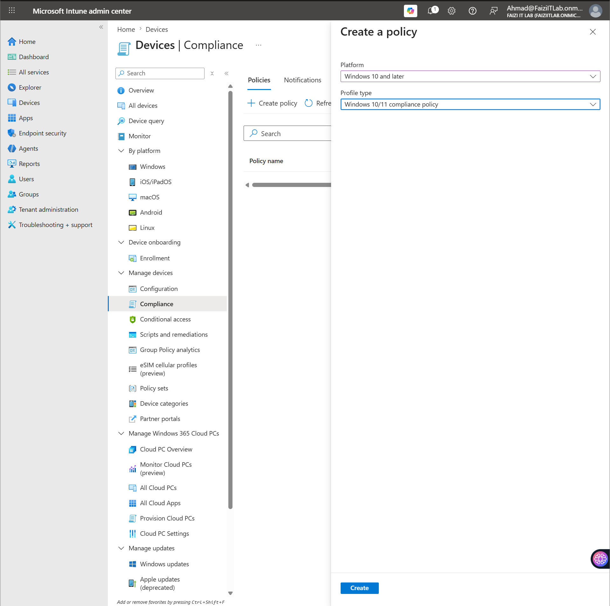

**Policy Details:**
| Attribute | Value |
|-----------|-------|
| **Name** | Win11-General-Compliance |
| **Description** | Requires BitLocker and Antivirus |
| **Platform** | Windows 10 and later |
| **Profile type** | Windows 10/11 compliance policy |

### 4.2 Compliance Settings

Configured the following device health and security requirements:

| Category | Setting | Value |
|----------|---------|-------|
| **Device Health** | BitLocker | Require |
| **Device Health** | Secure Boot | Require |
| **Device Health** | Code integrity | Require |
| **System Security** | Require a password to unlock mobile devices | Require |
| **System Security** | Simple passwords | Block |
| **System Security** | Password type | Device default |
| **System Security** | Minimum password length | 4 |
| **System Security** | Maximum minutes of inactivity before password is required | Not configured |
| **System Security** | Password expiration (days) | 41 |
| **System Security** | Number of previous passwords to prevent reuse | 5 |
| **System Security** | Require password when device returns from idle state | Require |
| **System Security** | Encryption | Require |
| **System Security** | Firewall | Require |
| **System Security** | Antivirus | Require |
| **System Security** | Antispyware | Require |
| **System Security** | Microsoft Defender Antimalware | Require |
| **System Security** | Microsoft Defender Antimalware minimum version | Not configured |
| **System Security** | Microsoft Defender Antimalware security intelligence up-to-date | Require |
| **System Security** | Real-time protection | Require |

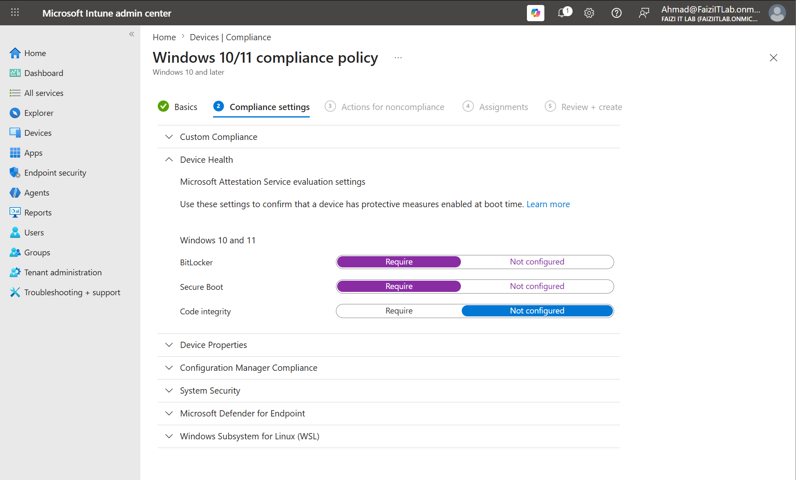

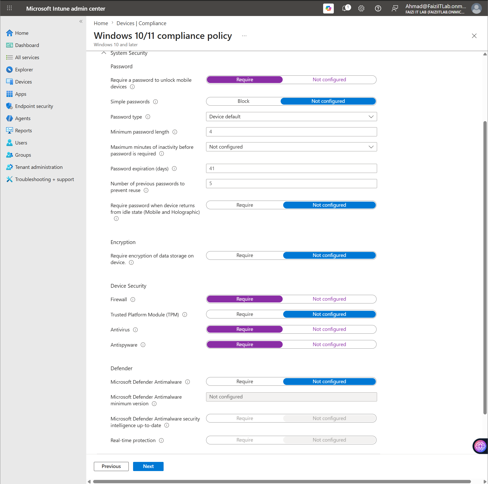

### 4.3 Actions for Noncompliance

Configured the response when a device falls out of compliance:

| Action | Schedule |
|--------|----------|
| **Mark device noncompliant** | Immediately |

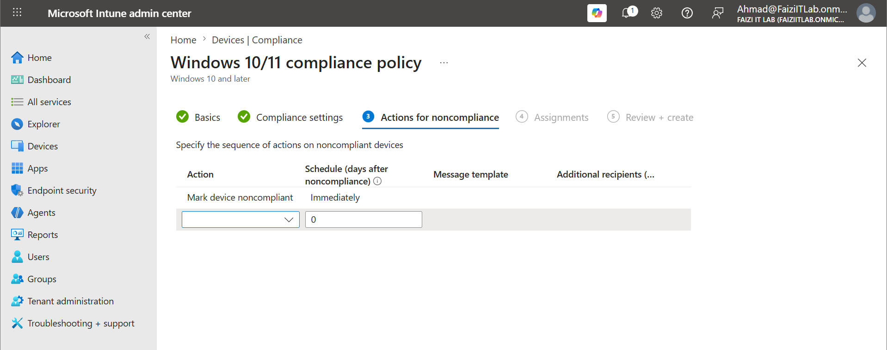

### 4.4 Policy Assignment

Assigned the compliance policy to **All users** with device group filtering set to **None** (all devices).

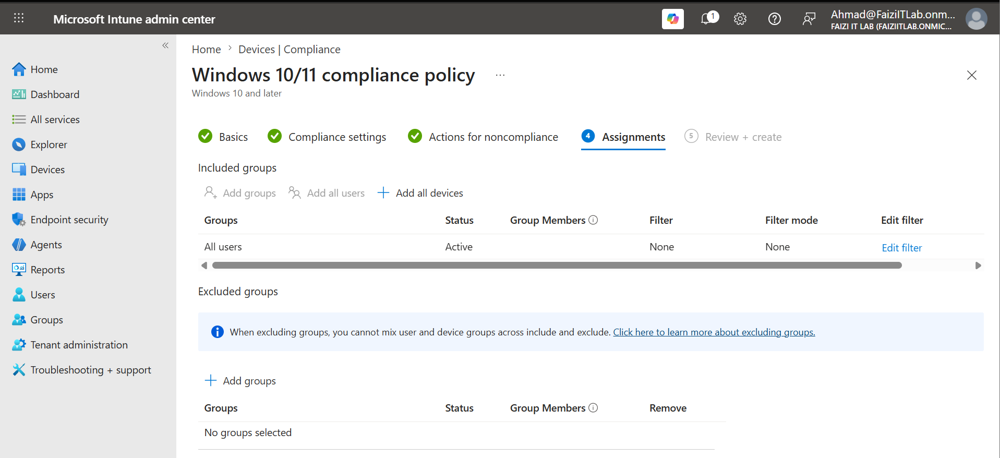

### 4.5 Policy Review and Creation

Reviewed the complete policy configuration before creating it.

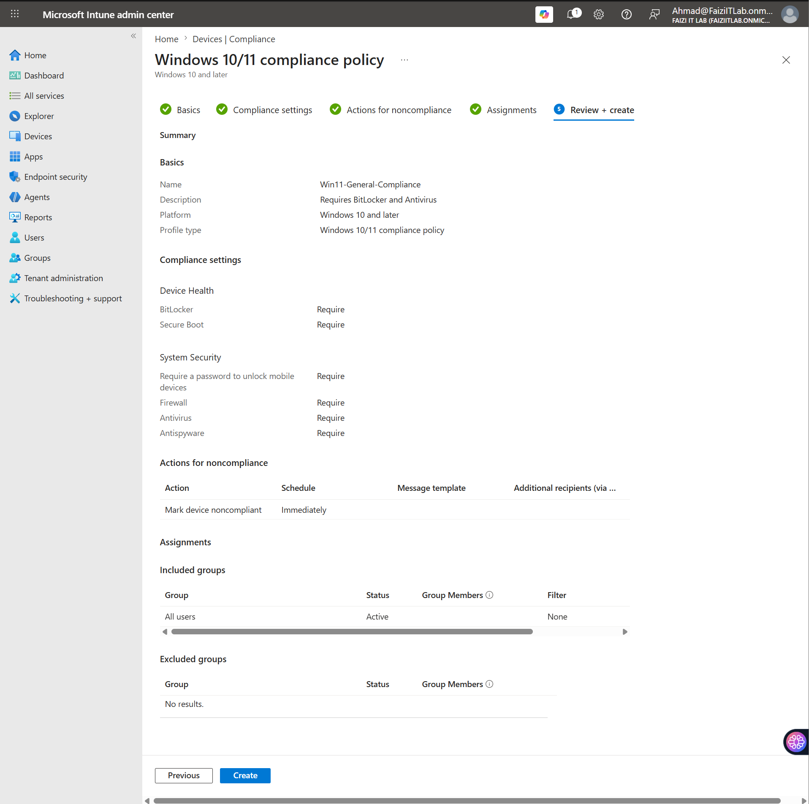

### 4.6 Compliance Dashboard

Monitored device compliance status through the Intune compliance dashboard.

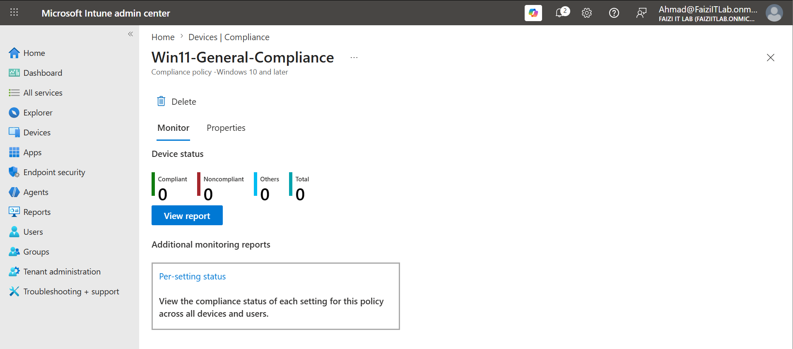

---

## 5. Enrollment Methods

### 5.1 Windows Autopilot

> **Note:** Full Autopilot deployment requires device hardware hashes to be registered with Microsoft. In this lab, the enrollment methods were configured to support Autopilot-ready devices.

**Supported Enrollment Methods:**
- **Windows Autopilot** — Zero-touch provisioning for new devices
- **Automatic MDM enrollment** — Via Azure AD join or hybrid join
- **Bulk enrollment** — Windows Configuration Designer packages

### 5.2 Device Categories

Configured device categories for organizational grouping (if applicable in tenant).

---

## 6. Testing & Validation

### 6.1 Compliance Policy Verification

- Reviewed the compliance policy list to confirm active policies
- Verified assignment scope covers target user population
- Checked that no conflicting policies exist

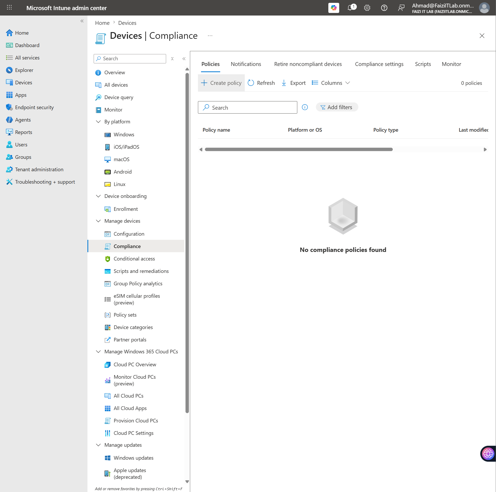

### 6.2 ESP Testing

- Simulated a new device enrollment via OOBE
- Confirmed the Enrollment Status Page displays app installation progress
- Verified that device blocks usage until all required apps/profiles are installed

---

## 7. Key Takeaways

| Lesson | Detail |
|--------|--------|
| **BitLocker + Secure Boot** | Requiring these at the compliance policy level ensures devices are hardware-secured before accessing corporate data. |
| **ESP Blocking** | Blocking device use until all apps install prevents users from working with incomplete configurations. |
| **Immediate Noncompliance** | Marking devices noncompliant immediately (rather than after a grace period) tightens security for high-risk environments. |
| **Password History** | Enforcing password history (5 previous) prevents users from rotating between common passwords. |
| **Conditional Access Integration** | Compliance policies are only effective when paired with CA policies that block noncompliant devices. |

---

## 8. Production Recommendations

- **Device Categories:** Use device categories to auto-group devices by department or location for scoped policy assignment.
- **Compliance Grace Periods:** Consider a 24–72 hour grace period for noncompliance in production to avoid immediate lockouts during policy updates.
- **Autopilot Profile:** Create dedicated Autopilot deployment profiles with pre-assigned apps for different user personas (e.g., Sales, Engineering, Executive).
- **Compliance Partner Integration:** Integrate with third-party MDM partners (if applicable) for cross-platform compliance.
- **Reporting:** Export compliance reports regularly for audit and security review purposes.

---

## 9. References

- [Microsoft Intune Enrollment Guide](https://learn.microsoft.com/en-us/mem/intune/enrollment/)
- [Windows Autopilot Overview](https://learn.microsoft.com/en-us/mem/autopilot/overview)
- [Device Compliance Policies in Intune](https://learn.microsoft.com/en-us/mem/intune/protect/device-compliance-get-started)
- [Enrollment Status Page](https://learn.microsoft.com/en-us/mem/intune/enrollment/windows-enrollment-status)
- [Create a Compliance Policy](https://learn.microsoft.com/en-us/mem/intune/protect/create-compliance-policy)

---

*Lab completed: Microsoft Intune tenant (faizi IT Lab) with Windows enrollment and compliance policies configured.*
